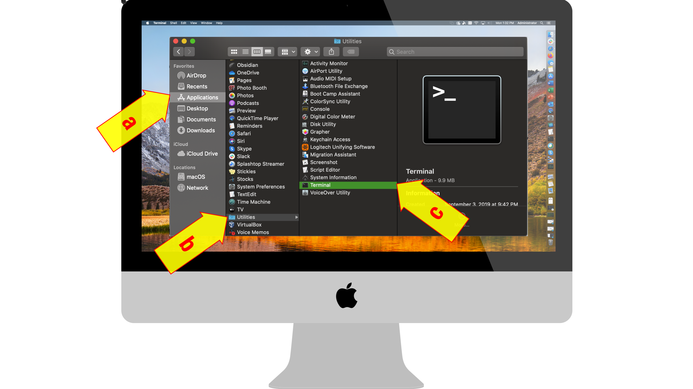
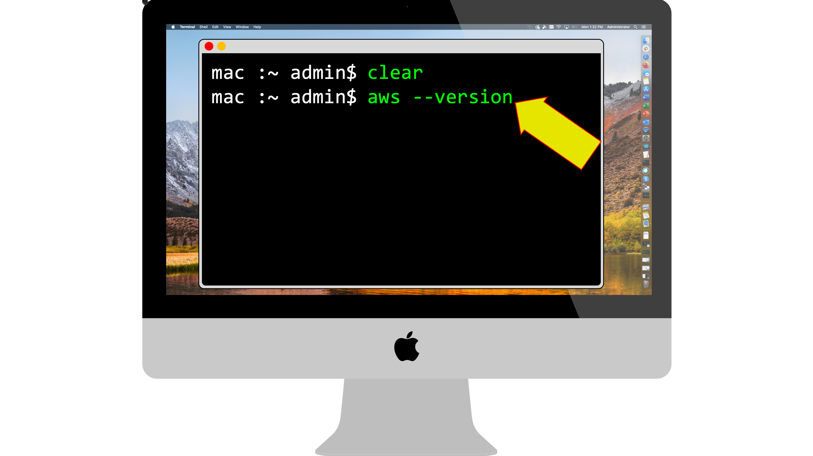
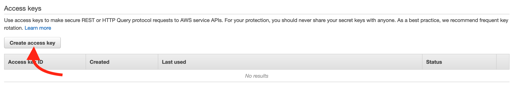
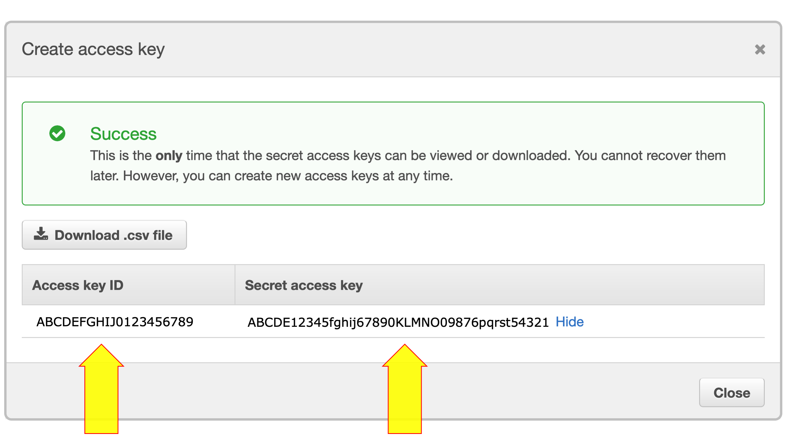
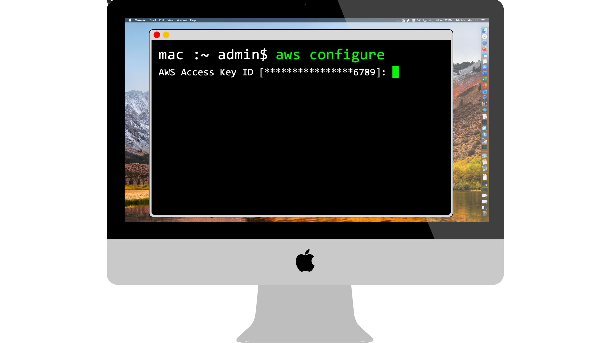

# Install AWS CLI on your Mac Terminal

## Purpose of the Repository

* Check whether AWS Command Line Interface (CLI) is installed on your *Apple Mac / MacBook / MacBook Pro / iMac Terminal*
* Instructions on how to *install AWS CLI*
* Instructions on how to *connect to AWS CLI from your Mac Terminal*
* Instructions on how to spin up your first AWS resource from AWS CLI (*an EC2 instance*)

## Steps to run the Repository
<br/>

### STEP 1. Launch *Terminal* in your Mac

<br/>

<p align="center">
  
</p>

<br/>

### STEP 2. Ensure you are *super user* who can run *sudo* commands. Execute the following command at the terminal's *prompt*:

```
sudo -v
```

If you are not a super user, you will get the following error - *Sorry, user <username> may not run sudo on <mac name>.*
  
If you are a super user, you will not get any response.  
  
Please note if you are not a super user, you will **NOT** be able to complete the remaining steps below.

<br/>

### STEP 3. To find the version of AWS CLI installed, execute at the terminal's *prompt*:

```
aws --version
```

<br/>

<p align="center">
  
</p>


If AWS CLI is not installed you will get the following error - *No such file or directory*

If AWS CLI is installed, you will get the following message - *aws-cli/X.X.X Python/X.X.X Darwin/X.X.X botocore/X.X.XdevX*

<br/>


### STEP 4. If AWS CLI is installed, please skip to STEP 7.

<br/>

### STEP 5. If AWS CLI is not installed, the first step is to install *Homebrew*.

Homebrew is a package manager for macOS. Please refer https://brew.sh/ for more information. To install Homebrew please paste the following command at the prompt.

```
/bin/bash -c "$(curl -fsSL https://raw.githubusercontent.com/Homebrew/install/master/install.sh)"
```

<br/>

> __Warning__
> **Important Step After Installation of Brew.** You will be required to run commands similar to the ones below MANUALLY. Brew installation will indicate the accurate commands at the end of this installation. BE SURE TO RUN THESE COMMANDS, or else you will get the error 'zsh: command not found: brew'

```
echo '# Set PATH, MANPATH, etc., for Homebrew.' >> /Users/xyz/.zprofile
echo 'eval "$(/opt/homebrew/bin/brew shellenv)"' >> /Users/xyz/.zprofile
eval "$(/opt/homebrew/bin/brew shellenv)"
```

### STEP 6. Install the *AWS CLI package*.

Paste following command at the prompt
```
brew install awscli
```

If you get a message saying *Error: The following directories are not writable by your user:*, you must prefix *sudo* with each of your commands at the prompt as shown below.
```
sudo brew install awscli
```
If your installation completes successfully, ***congratulations, you have installed AWS CLI on your mac terminal AWS CLI.***

<br/>


### STEP 7. Setup Programmatic Access to AWS.

a. Login to your AWS Management console from a web browser. (If you do not have an aws account, visit https://portal.aws.amazon.com/gp/aws/developer/registration/index.html to setup a **new account**. If you already have an aws account, please visit http://console.aws.amazon.com)

<p align="center">
  
</p>

<br/>

b. Once you reach the AWS Management console, in the *Find Services* search field, enter *IAM*. You will now see *Manage access to AWS resources* as the option. Click on to reach the *IAM Management Console*. Then click on *Users* and click on your *User name*. Then click on the security credentials tab. You will now see a button name *Create access key*. Click on this button. 

<p align="center">
  
</p>

<br/>

c. Once you click the button, you will see your AWS access key. Your AWS key has two parts - a 20 character (capitalized alpha numeric) ***Access Key ID*** and a 40 character (alpha numeric) ***Secret Access Key***. Please save both in a safe location. This is the ***only*** time AWS will display your Secret Access Key. *If you lose your secret access key, there is no way to recover it - you will need to create a new access key using the above steps.* 

<p align="center">
  
</p>

<br/>

### STEP 8. Configure AWS CLI credentials at your mac terminal.

Go back to the terminal and paste this command at the prompt.
```
aws configure
```


<p align="center">
  
</p>

<br/>

a. Paste your AWS Access Key ID, at the *Enter your AWS Access Key ID :* prompt. <br/>
b. Paste your AWS Secret Access Key, at the *Enter your AWS Secret Access Key :* prompt. <br/>
c. Type in which region you want to default to, at the *Default region name :* prompt. For the purpose of this instructions, please enter ***us-east-1*** at the prompt.<br/>
d. Type in what output format you want to default to, at the *Default output format :* prompt. For the purpose of this instructions, please enter ***json*** at the prompt, and click enter. 

### STEP 9. Check if the connectivity is established from your mac terminal to AWS

At the terminal, paste this command at the prompt:
```
aws sts get-caller-identity
```
<br/>

*If the connectivity is established, you will get a JSON response similar to whats shown below.*
```
{
    "UserId": "ABCDEFGHIJ0123456789",
    "Account": "123456789012",
    "Arn": "arn:aws:iam::123456789012:user/user1"
}
```
If you get this JSON response, ***congratulations, your mac terminal AWS CLI is connected to your AWS account.***


### STEP 10. Spin up the an *EC2 instance* in your AWS account, using mac terminal AWS CLI commands.
Now that you have the CLI installed, you can type in various commands to spin up and spin down resources in your AWS account. In the below example, we are going to spin up an *EC2 instance* in region *us-east-1*. Paste the following commands at the mac terminal prompt. 
```
aws ec2 run-instances --image-id ami-0c09d65d2051ada93 --count 1 --instance-type t2.micro
```


